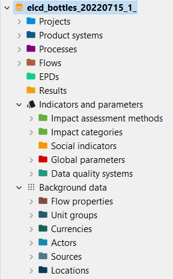

# Database elements

 
Once you opened or created a database, you'll see these elements in the navigation panel:

- **Projects:** Projects serve as a platform to compare different product systems, allowing users to assess and evaluate various scenarios.

- **Product Systems:** Product Systems in openLCA are sets of interconnected processes, linked by flows, that model the life cycle of a product. They are essential for calculating inventory results and conducting impact assessments, outlining the processes involved in producing or modifying products and materials.

- **Processes:** Processes are a set of interrelated or interacting activities that transform inputs into outputs within a product's life cycle. They outline the sequence of activities involved in producing or modifying products and materials, forming the core of a product system's structure.

- **Flows:** Flows represent products and materials in a life cycle, connected within the process network. They can be inputs, outputs, energy, and emissions.

- _**New!**_ **EPDs (Environmental Product Declarations):** openLCA allows import and creation of Environmental Product Declarations, EPDs. EPDs provide verified, aggregated environmental performance information for specific products.

- _**New!**_ **Results:** Results in openLCA are stored impact assessment results obtained from calculating product systems.

- **Indicators and Parameters:** Indicators and parameters serve as flexible components that can replace plain input/output values, on the process, Impact assessment method, product system, project and database levels. They are key for a flexible model, and ideal for scenario analyses where some aspects of a model need to be changed to check for potential impacts on the calculation result.

	- **Impact Assessment Methods:** in openLCA you can import different impact assessment methods. These methods provide the framework and algorithms to quantify and assess the environmental impacts associated with the product systems.

	- **Impact Categories:** Impact categories are classer representing environmental issues of concern to which life cycle inventory analysis result may be assigned (e.g. "global warming", "human toxicity").

	- **Social Indicators:** In openLCA users can assess social impacts, incorporating social considerations into the life cycle assessment.

	- **Global Parameters:** Global parameters can be found and are valid on all levels in the database (processes, product systems, etc.). They can be used to modify formulas and amounts across processes, for example, or also settings in that should be valid throughout an entire database, which makes them really powerful.

	- **Data Quality Systems:** Data Quality Systems are matrices designed to evaluate and record the reliability of data across three key levels: overall data quality within a process, data quality for each individual data exchange within a process, and data quality of social aspects. Data quality can be calculated for at the data exchange within processes level, and the score is shown in inventory results, the LCIA results / impact analysis, and sankey diagrams. Furthermore, uncertainty values can also be calculated from the matrices and can be used in the Monte Carlo simulation.

- **Background Data:** Background data summarize the elements that users typically don't engage with often, like units, locations and so on.

	- **Flow Properties:** Flow properties are characteristics or properties associated with flows, such as length, mass, volume, or other relevant attributes that help in quantifying and analyzing the flows.

	- **Unit Groups:** Unit groups are collections of units for a given flow property. For instance, units of area like square meters (m²), square feet (ft²), and square yards (sq. yd) are part of the same unit group. One unit group always has one reference unit, other units in the same group can be converted from one into the other. 

	- **Currencies:** In openLCA, you can assign costs to flows, which enables the calculation of the Life Cycle Costing of a product or service.

	- **Actors:** Actors represent individuals or entities. Actors can be researchers, experts, or stakeholders, e.g. data providers, reviewers, authors, and so forth.

	- **Sources:** Sources are references, citations, etc.. openLCA allows storing of the original pdf report and other supporting information for sources.

	- **Locations:** Locations are simply locations, and they can be a region, a country, or any other point on a map. They are important for localizing the supply chain and for calculating regional impacts.

**_Note:_** openLCA utilizes Universally Unique Identifiers (UUIDs) to identify and manage all entities, including processes, flows, product systems, projects, parameters, impact categories, and impact assessment methods. UUIDs are standardized identifiers ensuring uniqueness across systems or databases, even from one user to another.

