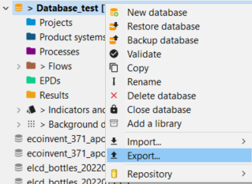
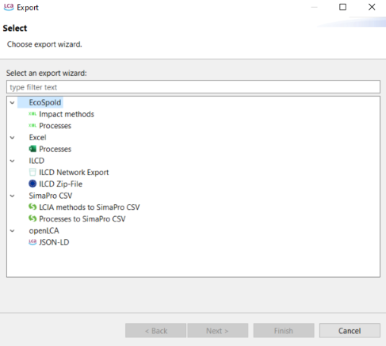
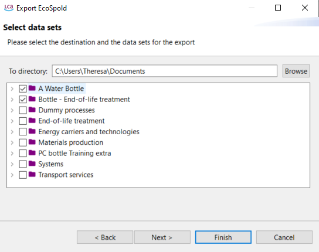
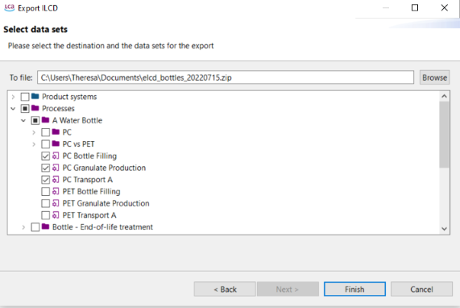

# Exporting databases

Exporting databases in openLCA allows users to extract and save data in various formats for further analysis or sharing.

openLCA supports data export in many formats, offering adaptability to different needs:

- **Ecospold:** Allows exporting impact assessment methods and processes.
- **Excel:** Enables exporting processes, analysis results, Monte Carlo simulation results, and more. 
- **ILCD Network Export:** Allows exporting data in the XML-based format adapted from the [International Life Cycle Data system](<https://eplca.jrc.ec.europa.eu/LCDN/developerILCDDataFormat.xhtml>) format.
- **SimaPro CSV:** Provides compatibility for exporting data in SimaPro CSV format.
- **JSON-LD:** Allows exporting databases in JSON-LD format, which is a standard for linked data encoding.

To export data from openLCA, follow these steps:

1. Activate the database you want to export from by double-clicking on it.
2. Click on "File" and select "Export" to open the export wizard.

  
  
_Exporting data from an active database_

3. Here we provide specific instructions for exporting different data types:

- **Ecospold:** Choose either "Impact method"s or "Processes" after clicking on
"EcoSpold". Select the destination directory and the datasets to export, then click "Finish".

  
_Selecting data/processes to be exported_

- **Excel:** To export processes as Excel files, select "Processes" after clicking on "Excel". Specify the export directory and the processes to export, then click "Finish". Each process will be saved as an individual Excel file.

- **ILCD ZIP-file:** Select "ILCD Zip-File" in the export wizard. Choose an export directory and the database elements to export in ILCD format. Click "Finish".

  
_Selecting the destination and the data set for the ILCD export_ 

- **SimaPRo CSV**: You can choose between exporting LCIA methods or processes in SimaPro CSV. Then click on "Next" to select the elements you whant to export, select a recipient folder for the CSV and and eventually click on "Finish".

- **JSON-LD:** Select "JSON-LD" in the export wizard. Choose an export directory and the database elements to export, then click "Finish". For details about JSONLD click [here](<https://www.greendelta.com/wp-content/uploads/2017/03/LCA_XV_JSON-LD_final.pdf>).

## Copy function

openLCA allows users to easily copy information from any table and paste it into other applications like Excel or Notepad. Please check "[Importing and exporting data](../cheat/import_export.md)" section for details.

