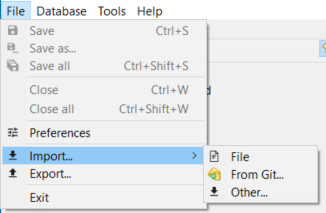
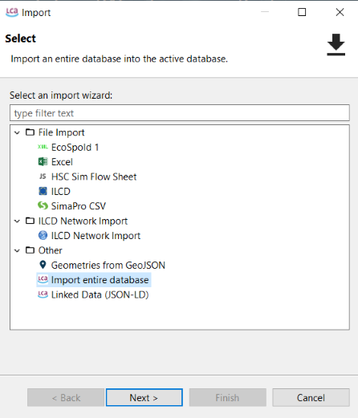
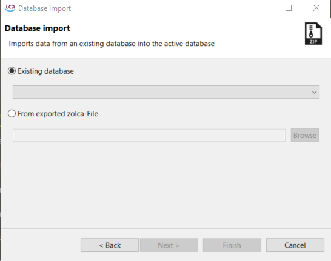
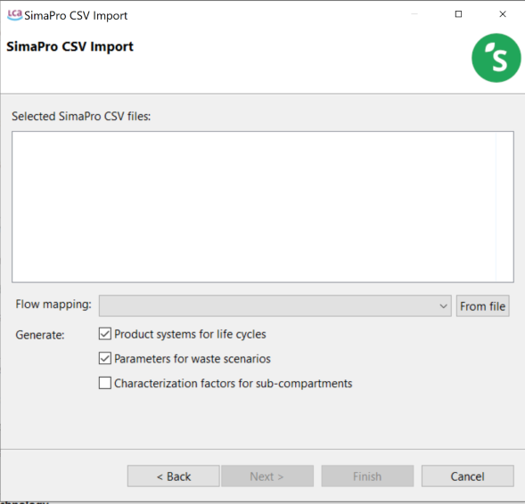
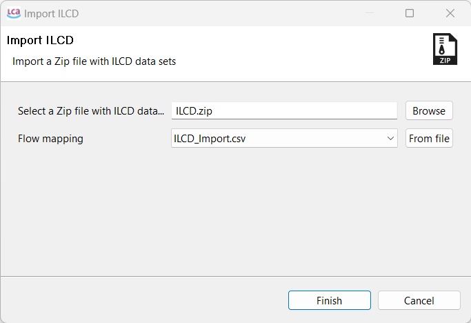
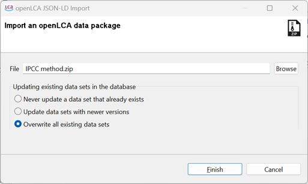
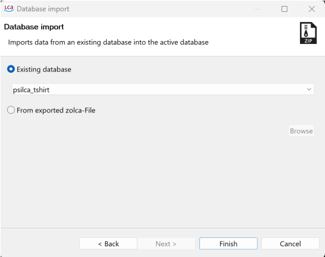

# Importing data and combining databases 

Previously we have described the "[Restoring a database](./restore_database.md)" function, which is specifically intended for zolca files. As working with data, in particular during the life cycle inventory data collection phase, is rather complex, openLCA supports various data formats to work with.

### Supported Import and Export formats:
- EcoSpold1
- ILCD
- Excel
- SimaPro CSV
- Zolca
- JSON-LD

 

**_Note for macOS users:_** If you are using Safari, the browser will automatically unzip your downloaded zip files. However, you need the zipped file for import in openLCA (e.g. when you want to import JSON-LD, methods packages, ILCD...). You can solve this issue in two ways: 

1. Use another browser for downloads, where the zip-files are not automatically unpacked after successful download.

2. Zip the archives again by using a third-party tool, because the build-in archive tool from Apple will add additional resources to the zip-file that can create issues when importing the file in openLCA.

## Importing data

To import data into openLCA, click on "File" and then "Import", or right-click on the Navigation Window and choose "Import".

  

Under the "Import" section, you can find the following options:

- **File:** This option allows you to import data in various formats, including zolca, EcoSpold 1, Excel, HSC Sim Flow (experimental), ILCD, and SimaPro CSV. The import format is detected automatically.
- **From Git:** This option enables you to establish a connection to a Git repository for importing data (what we do not do for now).
- **Other:** This option allows you to manually specify the format of the import, in the picture below you can see the wizard. 

      	

_Import Wizard_

The details for each option are displayed below:

<b>Importing a database from an exported zolca file</b>

The fastest way to open a zolca-format database in openLCA, is outlined in the "[Restoring a database](./restore_database.md)" section. Alternatively, you can use the "Import" function with the following steps:

1. Click on "File" and then "Import".
2. Select "Import entire database" and then click on "Next".
3. Choose the option "From exported zolca-File" in the import wizard.
4. Locate the desired zolca file in your file browser and select "Open". Then, click "Finish".

  
_Import from exported zolca-File_ 

After importing it, the database will be "inactive". To activate it and gain access to its flows, processes, and other components, simply double-click on it.

**_Note:_** The program decompresses the files into a different directory (C:\Users\NAME\openLCA-data-1.4). As a result, the original zolca file remains compressed and won't be directly affected by changes made to the database within the software

<b>Importing an existing database</b>

In openLCA, an existing database refers to a database that has already been imported or created within the software. To import data from an existing database into the currently active database, you can follow these steps:

1. Start by following steps 1 to 2 as described above.
2. Select the option "Existing database".
3. Use the drop-down menu to choose the desired database from the available options.
4. Finally, click on "Finish" to complete the import process.

<b>Importing databases and data sets as Ecospold, Excel, ILCD, SimaPro CSV, and JSON-LD</b>

By following these steps, you can import databases in various formats into existing openLCA databases, allowing you to expand and enhance your data resources:

1. If needed, create a new empty database in openLCA to also import the respective reference system (elementary flows, units etc.) from the database/data set.
2. Double-click on the target database to activate it before importing the data.
3. Navigate to the "File" menu and select "Import". Choose "Other" from the options.
4. Select the specific format of the database you want to import (e.g., Ecospold, Excel, ILCD, SimaPro CSV, or JSON-LD).

Here are some notes on specific formats, be aware that this is not an exhaustive guidance but provides just some key aspects:

- For **SimaPro CSV files**, add a flow in the window and optionally select a [flow mapping file](./mapping_validation.md). If you are importing multiple CSV files without a mapping file, import all the CSV files together to ensure correct mapping.

      

- **For ILCD files**, select the import file from the directory and optionally a [flow mapping file](./mapping_validation.md). ILCD databases have to be in .zip format to be imported.

      

- **For Ecospold1 files**, ensure to check and assign units using a [flow mapping file](./mapping_validation.md).
- **JSON-LD** is the in-house format for openLCA. You can import entire databases, LCIA methods or any other database element to import. JSON-LD data has to be in .zip format.  

    When importing JSON files, you have three options for the case of already existing datasets:

    

- **Never update a data set that already exists**: The system will check for matching UUIDs. If a match is found, the existing dataset will remain as it is.

- **Update data sets with newer versions**: If matching UUIDs are found, the system will update the existing datasets only if the imported version is newer (the version can be checked in the "General information" tab of every dataset).

- **Overwrite all existing data sets**: If matching UUIDs are found, the system will replace the existing datasets automatically with the imported ones irrespective of versioning.

    Datasets with UUIDs that are not present in the current database will be imported anyway, regardless of the option you choose.

    In [this chapter](../lcia_methods/importing_lcia_methods.md) you can find more details about importing LCIA methods in JSON format into openLCA, as the [openLCA LCIA methods pack](https://nexus.openlca.org/database/openLCA%20LCIA%20methods).

5. Click "Finish" to initiate the data import process. 
The duration of the import may vary depending on the size and complexity of the data.

<b>Importing GeoJSON files </b>

In openLCA 2, we introduced a new feature that allows you to import GeoJSON files, so you can incorporate geographic information for existing locations in the database. The feature compares attributes like name, UUID, or code of the locations in the database with the features specified in the corresponding GeoJSON file. This helps to find and assign the appropriate location. For example, you can use this method to import the GeoJSON file of ecoinvent locations available at [Geography ecoinvent](<https://geography.ecoinvent.org/>) using this method.

Within the database, GeoJSON data is stored in a compressed binary format. This approach reduces storage requirements and ensures fast loading of the data.

To import GeoJSON files, follow these steps:

1. Select "Geometries from GeoJSON" in the import wizard under "Other".
2. Choose the folder where the GeoJSON file is located.
3. Select the specific GeoJSON file you wish to import.

**_Note:_** If the GeoJSON file is in a zipped format within the selected folder, extract or unzip it before proceeding, as the import wizard can only add uncompressed GeoJSON files. The GeoJSON file may not be visible in the folder view, but it will be visible in the import wizard once the folder is selected.

## Combining databases

In openLCA, it is possible to merge multiple databases into a single one. The databases available in openLCA Nexus are carefully mapped to ensure that all elements within each database are accurately recognized and applied. This mapping prevents the creation of duplicate flows during import and guarantees the correct functioning of impact assessment methods.

To combine databases, follow these steps:

1. Begin by restoring/importing the first database. It is recommended to import the largest database first to minimize compilation time.
2. Activate the imported database by double-clicking on it.
3. Now, you can proceed to import the remaining databases by right-clicking on the active database, choose "Import" then "Other...".
4. Select "Import entire database", click on "Next" and eventually choose the database to import from databases that are already present in openLCA or from an exported zolca file (see picture below). Click on "Finish" to combine the databases.
5. The software will automatically combine the databases. The duration of this process may vary depending on the size of the databases involved. You can refer to this [instructional video](<https://www.youtube.com/watch?v=o2mqPFvpdMs>) on combining ecoinvent 3.1 databases for visual guidance.

 _You can decide to combine the active database with another database already present in openLCA or an exported database_

