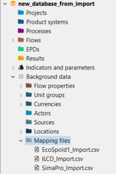
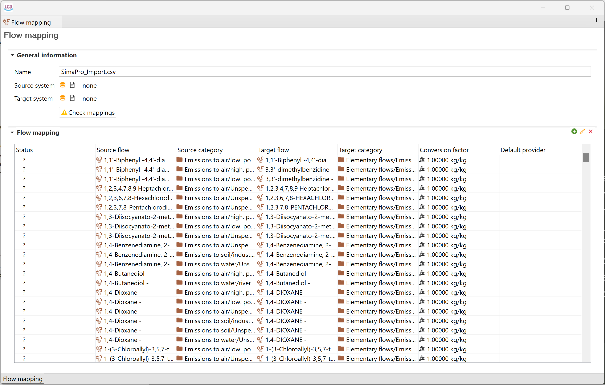
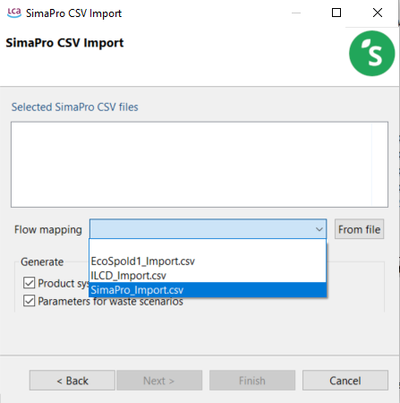
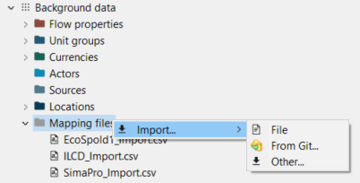
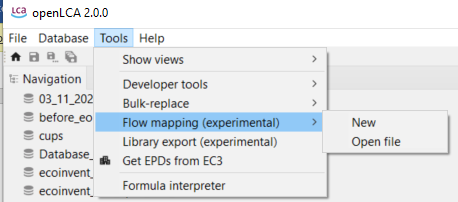
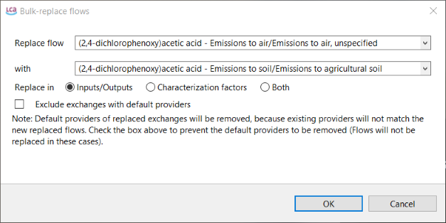
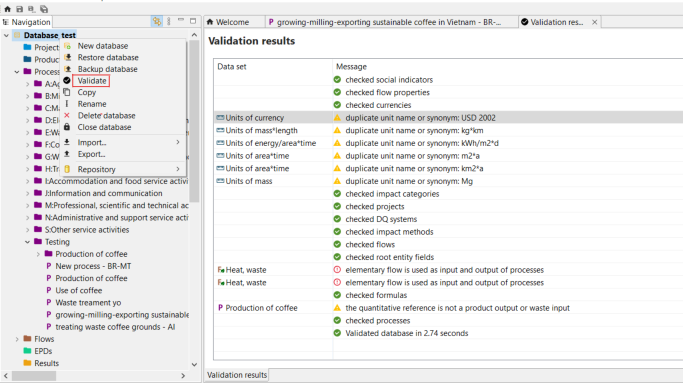

# Using mapping files in openLCA

When integrating databases from different LCA software that use different names for elementary flows, mapping files become essential for importing these databases into openLCA. These files describe the correspondence between flows in the source system and those in openLCA, facilitating the matching of elementary flow references. By using mapping files, you can align the elementary flow reference system of another data format with that of openLCA during the database import process. Mapping files are in .csv format, containing the necessary data for accurate mapping.

For your convenience, openLCA holds mapping files for the most common formats (ILCD, SimaPro, EcoSpold1) are included when creating a database with complete reference data, see section "[Creating a new empty database](./create_database.md)".

The database just created has a section "mapping files" under Background data, where you can find the mapping files for SimaPro, EcoSpold1 or ILCD:

  
_Location of mapping files in the navigation panel_

  
_Example of a mapping file_

The mapping file is required while "[importing a database](../databases/importing_and_combining_databases.md)" with different data formats, e.g. SimaPro, EcosPold1 or ILCD, see the figure below.

  
_Importing a database using a mapping file_

Always check how the mapping file fits to you data, and remember that you can also create your own mapping file following the column schema described on [this link](<https://github.com/GreenDelta/olca-modules/blob/master/doc/flow_mapping_csv_format.md>).

If you have a new mapping file, you can add it with a right click on "Mapping files" and then "Import".

  
_Importing a new mapping file_

You can also access the mapping files through the main menu bar at the top under "Tools".

  
_Importing a new mapping file_

For the manual correction of elementary flows or providers, you can also use the "Bulk-replace" function under "Tools":

  
_Using the bulk-replace function for flows_

_**Note:**_ Please always make sure that your mapping was done correctly using the "Validation" (see below) or after a calculation, having a look into the "LCIA checks" tab. Check out the "[Results Analysis](../res_analysis/analysis.md)" chapter for details.

# Validation of a database

The validation option serves to confirm the integrity of inter-linkages within a database following the import and mapping processes. It ensures that all connections within the database are functioning correctly and accurately. Validate a database is particularly helpful to confirm the accuracy of imported data from external sources and its integration into the existing database. To validate a database, right click on the it and click on "Validate".

In case the validation process encounters errors, it is crucial to address any missing links before proceeding with further modifications. If validation proves to be impossible, it is recommended to discard the recent changes, retrieve the repository again, and start over by committing the modifications.
  
Examples of validation messages: 
- the presence of duplicates or synonyms for a unit
- the quantitative reference is a product input or waste output

  
_Example of errors when validating an active database_

In general, errors may arise when corrupt records are retrieved from the repository, or the flows of the database appear to be incompatible (it might be required using a mapping file during the import).

