# Process tab content

After opening a process in openLCA, you will find tabs at the bottom of the window, that provide access to different information and settings relevant to the process.

  
_Tabs of the process window_

Let's explore the contents of these tabs in detail (click on the arrow to expand the text):

<b>General information</b>

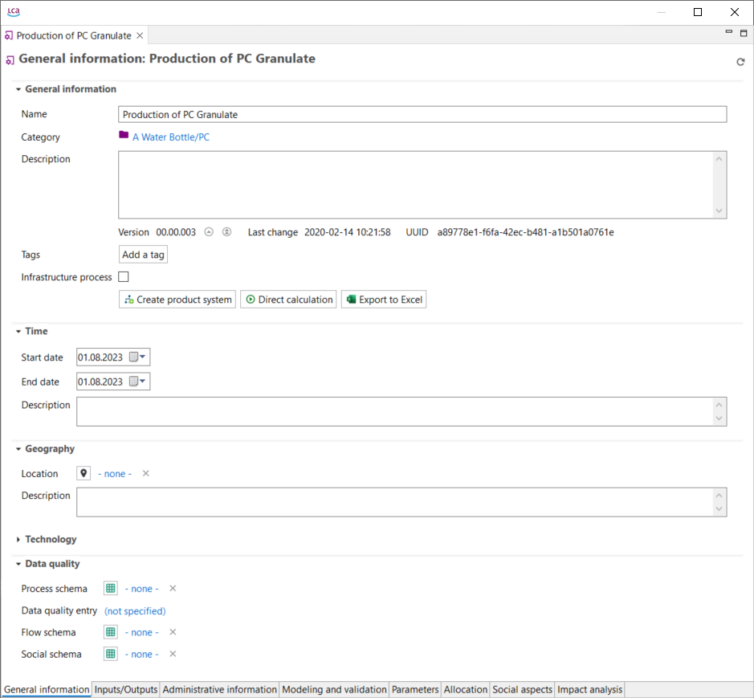  
_General information tab of a process_

Here you can view and modify the name of the flow, add a description, additional details or [tags](../cheat/tags.md), create a [product system](../prod_sys/Creating.md) from the process and export the process tabs to an Excel file. Additionally:

**_Note on "infrastructure process":_** This checkbox serves to store whether a process is infrastructure process or not (so, the process is a product with long lifetime and costly – a building, a machinery, …). This is a mandatory field in the EcoSpold1 format and also used by SimaPro e.g.. In openLCA, it has no practical effect.

**Direct calculation:** The "Direct calculation" feature generates and then calculates an in-memory product system, connecting processes using default providers or the first found connection. Reproducible and correct results are only obtained if there are unambiguous connections between these processes, i.e. if either there is always only one producing process for a product, or there is always a default provider set, to make the connection to the providing process clear and unique. 

If you are unsure about the connections, check the linking properties of a database, either via "Database → Check linking properties" or via the "Check linking" option in the pop-up window after selecting "Direct calculation":

  
_Check linking prior calcuation_

The main advantage of "Direct calculation" is its lower memory usage. It bypasses the need to create a separate product system in advance. This is particularly practical when working with databases that create very large product systems such as PSILCA and exiobase.

### Time 
 
In the time section, you can add and edit the start and end time of the process as well as provide any relevant descriptions.
 
### Geography

In the Geography section, you can add and edit the location of the process. Clicking on the chosen location, you can also see it on a map. 

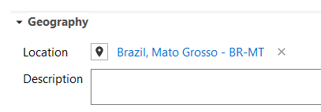  
_Add a location to a process_
 
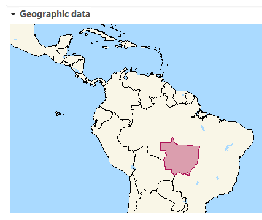  
_View a location on a map_

### Technology 

In the Technology section, users have an add a description about the technology employed in the process.

### Data quality

Here you can define the data quality flow schema for your process. Check [Data Quality](../advanced_top/data_quality.md) section for details.

<b>Inputs/Outputs</b>

As we’ve seen, a process encompasses all the inputs and outputs associated with an operation. Let's look at the setup of an Input/Output table of a process in openLCA.

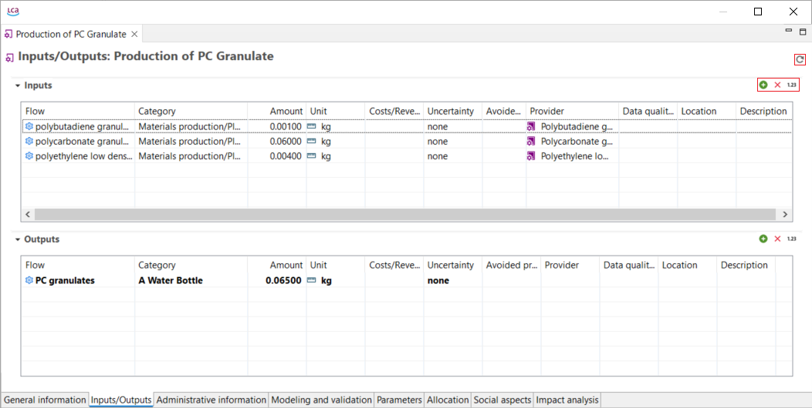  
_Inputs/outputs tab window with highlighting on the tools to the right top corner_ 

In the top right corner, you will see several icons: "Refresh" (circled arrow), "Add Flows" (green plus), "Delete Flow" (red x), and a "123"/ "fx" icon you can use to switch between displaying the "Amount" as either a value or formula (when mathematical operations have been applied).

_**Note:**_ A waste can also be designed as an input covering recycling approaches in openLCA. Then it is possible to select "avoid product" to define a supplier. Check ["Waste"](../waste_modelling.md) section for details.

<b>Flow</b>

Product, elementary, and waste flows can be added as inputs or outputs to the process in several ways. You can drag and drop them from the navigation panel, double-click on an empty flow cell, or click on the green plus icon. A pop-up wizard will appear in which you can manually select the flows from the drop-down list or utilize the filter option to narrow down the choices. Moreover, you can also drag and drop processes into the input/output section. This will automatically add the respective reference flow to the table with the selected process as a provider.

<b>Category</b>

The "Category" column displays the child category of the flow, indicating its placement within the folder structure.

<b>Amount</b>

You can enter the amount of the flow as values, formulas, and/or parameters. 

- To view the calculated value, click on the "_123_" icon located in the top right corner.
- To see the original formula/parameters, click on the icon again, which will change to the "_fx_" icon.

**_Note:_**
- When a formula and/or parameter is typed in the "Amount" field, the software will calculate the value for the amount automatically.
- Complex formulas must adhere to a specific format (e.g., Tan(a), trunc(c), etc.). Have a look in ['Constants, operators and functions for formulas in openLCA'](../advanced_top/formulas_in_openlca.md) chapter.
- You can use the formula interpreter, accessible under "Tools" → "Formula Interpreter", to identify errors within your formulas. 

<b>Unit</b>

openLCA supports a wide range of measurement unit types to represent different physical quantities. Some common types of units available in openLCA include:

- Mass: Kilograms (kg), grams (g), tons (t), etc.
- Volume: Cubic meters (m³), liters (L), gallons (gal), etc.
- Energy: Joules (J), kilowatt-hours (kWh), megajoules (MJ), etc.
- Length: Meters (m), kilometers (km), miles (mi), etc.
- Time: Seconds (s), minutes (min), hours (h), days (d), etc.
- Money: Currency units such as USD, EUR, GBP, etc.
- Area: Square meters (m²), square kilometers (km²), hectares (ha), etc.
- Pressure: Pascals (Pa), bar, psi, etc.
- Temperature: Celsius (°C), Fahrenheit (°F), Kelvin (K), etc.
- Electric Current: Amperes (A), milliamperes (mA), etc.

Units are assigned to the flows based on the flow property defined in the "[Flow properties tab](../flows/flow_tabs_contents.md)" You have the flexibility to change units by clicking on the unit cell and choosing a different unit from the provided list. If a conversion factor is available, the amount will be automatically converted to the newly selected unit.

**_Note:_** openLCA allows users to create **custom/new units**. This can also be done in the "[Flow properties tab](../flows/flow_tabs_contents.md)".

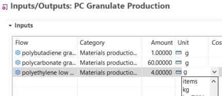   
_Changing flow units within a process editor_

<b>Cost/Revenue</b>

openLCA has the capability to assign costs and revenues to processes, which enables conducting [Life Cycle Costing](../res_analysis/lcc.md) studies.

To add or modify a cost/revenue value, follow these steps:

- Select a cell in the "Costs/Revenues" column, click on it and select "Edit".
- Specify your desired currency and enter the overall costs or revenues for the corresponding flow in the pop-up window.
- The software automatically calculates the price per unit based on the value in the "Amount" column.
- Revenues are displayed in green, while costs/expenses are shown in violet.

  
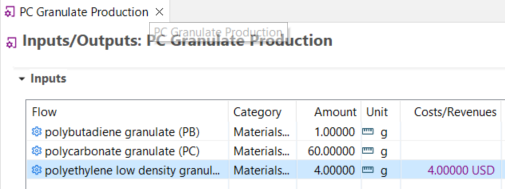  
_Adding costs to flows_

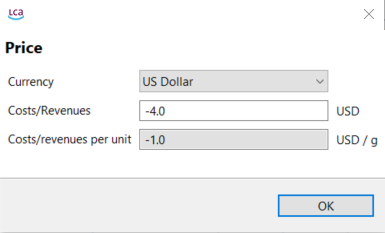  
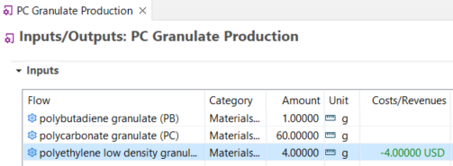  
_Adding revenues to flows_

**_Note:_**: openLCA allows you to create **custom/new currencies**. It can be done in the "Currencies" folder in the "Background data" section of the Navigation panel. 

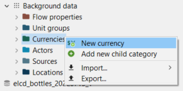  
_Creating a new currency_

<b>Uncertainty</b>

Users have the option to associate uncertainties to data in their LCA studies. Otherwise, this cell is set to 'none' in a user-created process..

To add uncertainty data to flows, follow these steps:

- Click on the uncertainty cell corresponding to the flow and select "Edit".
- Choose the desired uncertainty distribution, such as logarithmic normal, normal, triangle, or uniform and fill in the required data.

  
_Adding uncertainty information, step 1_

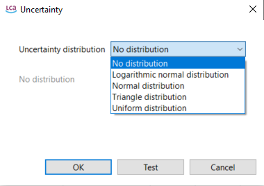  
_Adding uncertainty information, step 2_

**_Note:_** Uncertainty data can also be defined for parameters and LCIA characterization factors in a similar manner. 

<b>Avoided waste</b>

Avoided waste occurs in a situation where the waste from a process becomes a resource for another process. System expansion is a technique used to account for avoided waste. Learn more about the concept of avoided waste in the "[Waste modelling](../flows/waste_modelling.md)" section, and explore the concept of system expansion in the "[Allocation](../allocation.md)" section.

<b>Provider</b>

In openLCA, a "provider" refers to the process that supplies a specific flow (the source or origin of a particular input or output flow). Output "providers" are waste treatment processes, taking the waste generated in a process. You see that the name does not perfectly fit here but we did not set up a new name. The provider information helps to establish the relationships and dependencies between different processes and flows within the LCA model, and makes the input / ouput unique. It can be overwritten in a product system, meaning that you can select a new, different connecting process in a product system.

To choose a provider for a flow, follow these steps:

1. Click on the provider cell corresponding to the flow and choose "Edit".
2. From the drop-down list, select the specific provider for the flow (in cases where multiple providers exist for the same product flow). 

Note that many processes from databases like ecoinvent have predefined default providers. To access detailed information about the provider, simply right-click on a flow and select "Open provider".

**_Note:_** When creating a product system in openLCA, the software can automatically handle flows with multiple providers. It offers several options for auto-linking processes, which are explained in detail in the ["Creating a new product system/Settings for a product system"](../prod_sys/Creating.md#settings-for-a-product-system) section.

<b>Data quality</b>

Check out the ["Data quality"](../advanced_top/data_quality.md) section. 

<b>Location</b>

By default, the location of the inputs and outputs are automatically set to match the location of the process. However, you have the option to customize the location for the individual flows.

To modify the location:

- Click on the location cell associated with the flow you want to change and select "Edit."
- A pop-up window will appear, allowing you to choose a location from the available options. You can also apply filters to find the desired location.

Gain more insight into the use of locations in the "[Regionalized LCA](../advanced_top/regionalized.md)" section. 

<b>Description</b>

Add a description or additional details about the process.

 

<b>Administrative information</b>

The "Administrative Information" tab is where you can input or find dataset-related details such as ownership, publication, access and use restrictions, and more. It's important to note that the entries in the administrative information section do not have any impact on the actual calculations.

  
_Administrative information of a process_

<b>Modeling and validation</b>

The "Modeling and validation" tab is where you can input or find details on modeling and data and process validation.

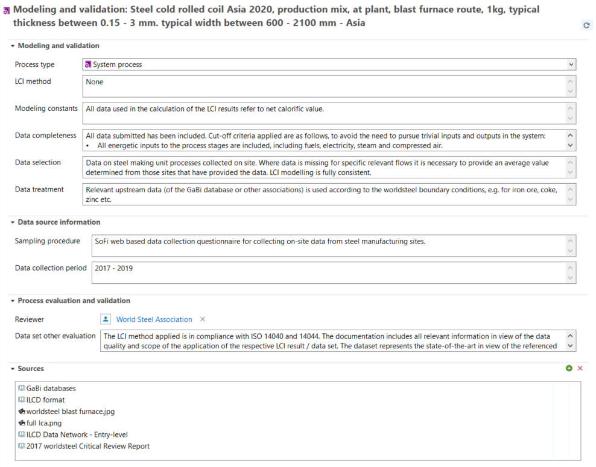 
_Modeling and validation tab_

The "Modeling and validation" tab is allows users to:

- Specify the process type, whether it is a unit or system process.
- Describe the Life Cycle Inventory (LCI) method used.
- Note any modeling constants utilized in the analysis.
- Provide information about data completeness.
- Discuss the data selection process if relevant to your study.
- Detail the data treatment methods applied.
- Discuss the sampling procedure employed for data collection.
- Define and document the data collection period.
- To add a data sources, click on the green "+" icon in the "Sources" section. If the required source is not listed, you can add a new one by right-clicking on the "Sources" folder in the Navigation and selecting "New source."
- You can also include reviewers by clicking the blue "Add actors" icon within this section. If the actor you want to add isn't listed under "Actors," you can create a new one by right-clicking on the "Actor" folder in the Navigation panel and selecting "New actor."

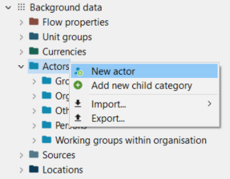  
_Adding a new actor in the navigation panel_

It's important to note that the entries in the modeling and validation section do not have any 
impact on the actual calculations. 

<b>Parameters</b>

Check out the "[Parameter](../parameters/parameters.md)" section. 

<b>Allocation</b>

Check out the "[Allocation](../allocation.md)" section. 

<b>Social aspects</b>

Check out the "[Social aspects](../advanced_top/social_aspects.md)" section. 

<b>Impact analysis</b>

In the "Impact Analysis" tab of a process, the process's direct impact is calculated. Hence, only elementary flows present in this process (no upstream impacts) will be considered. You can choose the impact assessment method directly within the tab and the results will dynamically update accordingly. Check out the "[Direct calculation](../cheat/direct.md#direct-calculations-in-the-impact-analysis-tab)" section. 

  
_Impact analysis of a process_

_**Note**_:  The "impact Analysis" tab only provides you with the impacts of this particular process. Hence, the overall impacts are displayed only in the case of using system processes. In case of using a unit process-based database, only the direct impacts (elementary flows used in this process) will be calculated.

To dive deeper into the subject of LCA calculations, you can explore the sections "[LCIA methods and categories](../lcia_methods/importing_lcia_methods.md)" and
"[Calculation and Result Analysis](../res_analysis/index.html)".

