# Model graph

The model graph in openLCA is a powerful tool for the visual representation of the product system including its supply chain (linkages to processes). It shows the interconnections of the product system's processes and flows, showcasing the supply chain (upstream and downstream) of a product. Here we will describe its functionality in detail. 

<b>Quick start</b>

If you open the model graph tab, you will see the reference process of the product system. Double-clicking on processes within the graph will show the flows on their input and output side. You can expand the visible supply chain by clicking on the "+" symbol next to the name of the processes. To hiding/collapsing it, click on the "-" symbol. You can also freely reposition processes without disconnecting them by dragging them around the window. 

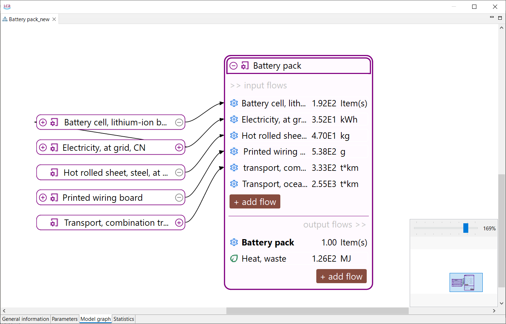
 _The model graph with expanded (first tier) and still collapsed processes (second tier). As visualized, we activated the options "Show elementary flows" and "Enable process editing" under right click "Settings"._

To show elementary flows and adding or removing flows directly within the graph, right-click on the graph, click on "Settings" and then check "Show elementary flows" and "Enable process editing".

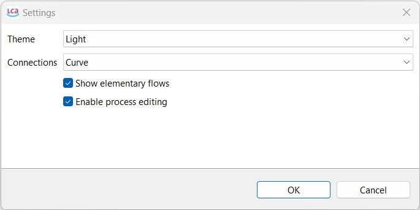
 _Activated settings in the model graph._

Connections between processes are visualized as lines. Those connections or the processes themselves can be deleted. Note, that alterations to the model have an influence on the entire product system and that only connected processes will contribute to the product system's calculation.

With this new feature, you can use the brown "+ add flow" button to modify processes by adding new input or output flows. A pop-up window will appear so you can add or create the new flow.

 _Model graph -> Process editing -> Add/Create new flow_

This allows you to model the product system directly within the model graph. After adding a new flow to a process, you need to add its provider. This can be done by right-clicking on the flow, then "Search providers".

 _Model graph - Search providers_

A pop-up window will appear with a list of all possible providers for that flow. You can select the right one and check the box "Connect" to add the provider and connect the flow to the process at the same time. Likewise, it is possible to search for recipients for specific outputs.

 _Model graph - Search providers - Connect_

**_Note_**: If you add processes with this function, the full supply chain will be NOT added. You have to manually add it afterwards, using the "Build flow supply chain" function (see below).
 
Moreover, if you want to create/edit the product system graphically, you can **drag and drop processes** from the navigation panel into the model graph void area. Then you can drag a flow to the corresponding one in the provider/receiver process to create the connections between the flows. To connect the newly added process to its supply chain, right-click on it and then select "Build supply chain".

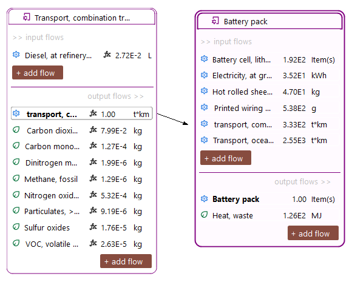
 _Model graph - After a drag and drop of a process, the flows are connected manually_

You can also remove connection by right-clicking on a process and choosing "Remove connections" or by clicking on a connection and then selecting "Delete". The software will ask you if you also want to delete or hide the supply chain. Choose "No" to solely remove the connection. The result is shown below:

 _Model graph - Example of removing a connection (before)_

 _Model graph - Example of removing a connection (after)_

Removing a connection can be useful when you want to assess the impact of your product system without a particular process, e.g. "printing wiring board" in the example, or more broadly, without considering a specific phase like the "use phase" of a product.

**This was a glimpse of how you can use the model graph. See below for more details:**

<b>Zoom bar (new)</b>

A new feature in openLCA 2 is the zoom bar on the right bottom, which allows adjusting the reading size and display section by zooming in and out. You can either use the zoom bar directly or scroll with the mouse to zoom in and out. Holding the keyboard space bar while scrolling allows vertical movements, and pressing alt + SHIFT while scrolling allows horizontal moving. In addition, you can reposition the graph by clicking and dragging it on the screen. Holding the space bar while clicking and dragging a process will result in the movement of the whole graph.

<b>Selecting processes</b>

Several processes can be selected at the same time by pressing the Ctrl keyboard (Control), clicking on the void area and dragging the selection outline over the processes you want to select.

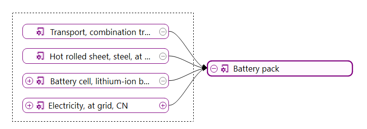
 _Model graph - Multiple process selection_

<b>Right-click in the model graph</b>

By right-clicking on the background in the model graph, the following options will appear:

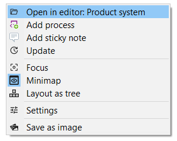
 _Model graph - Options (background)_

- **Open in editor: Product system:** Brings you to the "General information" tab of your product system.
- **Add process**: Adds a process to the model graph without connecting it.
- **Add a sticky note**: You can add sticky notes to your graph. They will be stored locally in the openLCA-data-1.4 folder and not in the database itself.

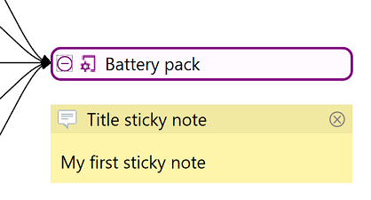
 _Model graph - Sticky note_

- **Update**: With "Update" you can reset the connections between processes. In the popup window, you have the option to choose between the same "provider selection" and "preferred process type" options that are available when calculating a product system. Additionally, you can select "Keep all existing links" and "Prefer links within the same location."

- **Focus**: Positions the reference process in the middle of the view window. 

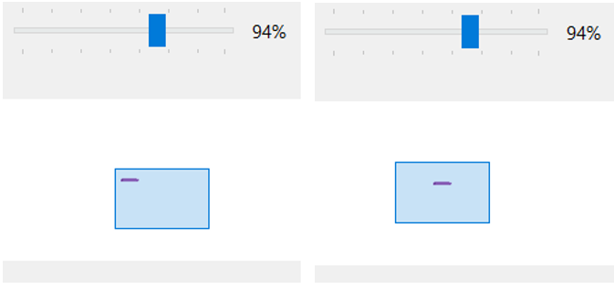
 _Model graph - Focus_

- **Mini-map**: Displays a miniature view with a zoom bar. This helps you navigate in complex model graphs. The blue area represents the current view.

- **Layout as tree**: Arranges the processes in the model graph so that those at the end of a supply/value chain are positioned to the right side of the graph.

 _Model graph - Tree layout (left before, right after)_

- **Maximize or Minimize**: Maximize allows to see the input and output flows, the corresponding amount and unit. The quantitative reference is in bold. Minimize will collapse the information beside the process name. A double-click on the process name either maximize or minimize it.

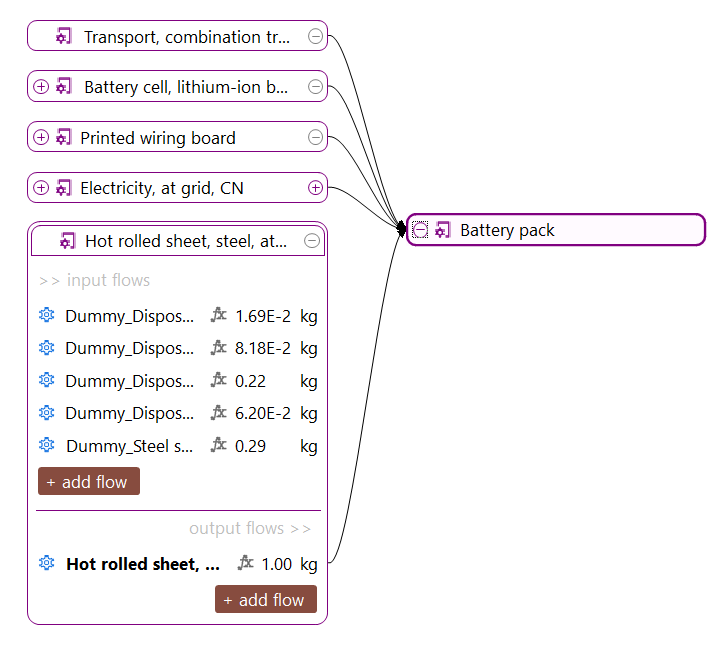
 _Model graph - Maximize_

- **Settings**: In the settings pop-up window, you can personalize the graph's theme, choosing between dark or light mode, adjust the shape of connection lines, enable the display of elementary flows, and activate in-graph process editing.

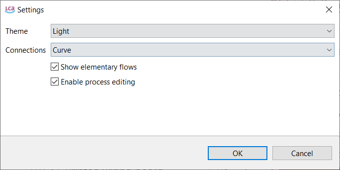

_**Note**:_ As we’ve seen, you can use the model graph "settings" to switch between a light and a dark theme. Themes can also be modified by editing the .css files under /openLCAdata-1.4/graph-themes. To reset the themes to the original one, simply delete (or rename) this folder before launching openLCA. In addition, the colours of the model graph elements marked with #model (note that #sankey, refers to the Sankey diagram) can be modified by changing the hexadecimal colour codes (using Google colour selector for example). It is very important to keep the same syntax of the document (no changes can be made outside of the bracket {}).

- **Save as image**: Saves an image of the model graph as .png file

<b>Right-click on a process in the model graph</b>

By right-clicking on a process in the model graph, you find the following additional options:

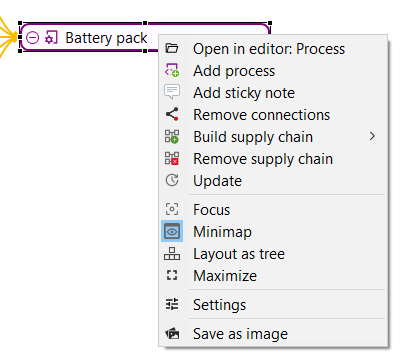
 _Model graph - Options_

- **Open in editor: Process**: This option will lead you to the general information tab of the selected process.

- **Delete**: Removes not only the selected process but all the processes that are linked only to it. Here is an example of deleting the process "Printed wiring board". 

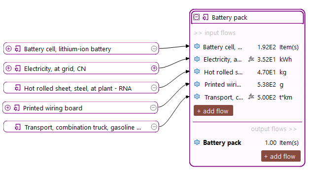
 _Model graph - Example of deleting a process (before)_ 

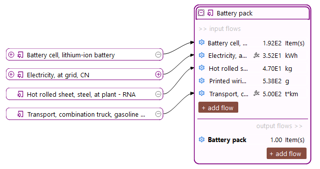
 _Model graph - Example of deleting a process (after)_

- **Remove connections**: The same can be achieved by right-clicking on a connection and selecting delete. When removing a connection, the software will also ask you if you also want to delete or hide the supply chain.

 _Deleting or hiding the supply chain_

_**Note:**_ Deleting the supply chain when removing the connection of a process, removes it from the product system entirely. The "Hide" option, otherwise, lets you retain the supply chain. This is important when your supply chain has multiple connections within your product system. For instance, if you delete the link to "Electricity, at grid, CN," it will also disappear from other processes using the same electricity source. Therefore, we recommend using "hide" if you're unsure about the supply chain within the whole system (otherwise check with [Usage](../cheat/usage.md)).

 _Model graph - Example of removing a connection (before)_

 _Model graph - Example of removing a connection (after)_

To add a provider to a flow that is missing one, right-click on the respective flow and select "Search providers".

 _Model graph - Search providers_

A pop-up window will appear with a list of all possible providers for that flow. You can select in the table which provider you would like to add to the model graph and check off "Connect" to automatically connect the process to the flow. Likewise, it is possible to search for recipients for specific outputs.

 _Model graph - Search providers - Connect_

**_Note_**: If you add processes with this function, the full supply chain will be NOT added. You have to manually add it afterwards, using the "Build flow supply chain" function (see below).

Otherwise, you can also draw connections by dragging from one flow to another flow! To do that, you need to have the respective processes expanded, then click on the provider flow and drag it to the receiver flow:

 _Manually connection flows_

- **Build supply chain**: Allows you to connect processes in the model graph. You can then select whether to build the complete supply chain for the process or just the next tier. Next tier means adding one provider without its supply chain.

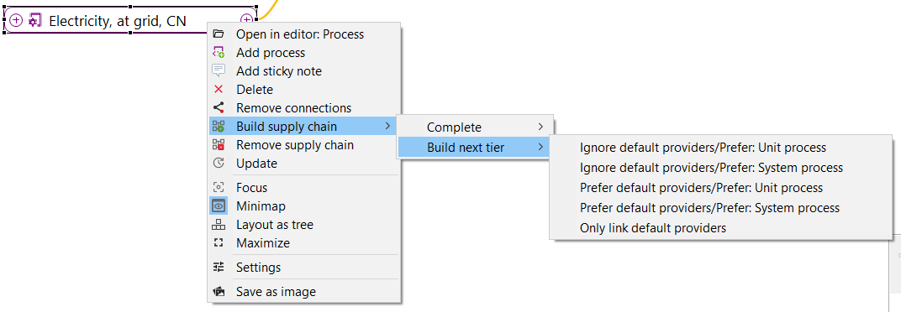
 _Model graph - Build next tier_

- **Remove supply chain**: This option will remove all processes and respective connections prior to the selected process. The option does not ask if you are sure to do this. If you click on it by accident close the product system on the tab and do not save the changes made.
 

<b>Right-click on a connection in the model graph</b>

By right-clicking on a connection in the model graph, the following additional options will appear:

- **Delete**: **Removes only the selected process!**

 _Deleting or hiding the supply chain_

_**Note:**_ Deleting the supply chain when removing the connection of a process, removes it from the product system entirely. The "Hide" option, otherwise, lets you retain the supply chain. This is important when your supply chain has multiple connections within your product system. For instance, if you delete the link to "Electricity, at grid, CN," it will also disappear from other processes using the same electricity source. Therefore, we recommend using "hide" if you're unsure about the supply chain within the whole system (otherwise check with [Usage](../cheat/usage.md)).

 _Model graph - Example of removing a connection (before)_

 _Model graph - Example of removing a connection (after)_

To add a provider to a flow that is missing one, right-click on the respective flow and select "Search providers". 

 _Model graph - Search providers_

A pop-up window will appear with a list of all possible providers for that flow. You can select in the table which provider you would like to add to the model graph and check off "Connect" to automatically connect the process to the flow. Likewise, it is possible to search for recipients for specific outputs.

 _Model graph - Search providers - Connect_

Otherwise, you can also draw connections by dragging from one flow to another flow! To do that, you need to have the respective processes expanded, then click on the provider flow and drag it to the receiver flow:

 _Manually connection flows_

<b>View tab in the tool bar</b>

The "View" tab allows to access some of the options described above, as well as some additional ones:

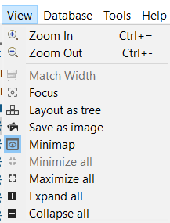
 _Model graph - View_

- **Expand all:** Expands the model graph to show all connected processes.
- **Collapse all:** Minimizes connected processes to show only first and second tier.
- **Match with:** To match the length of a process with another one first click on the process you want to change; press Crtl and click on the process which has the desired length. Then use the "Match with" option.

 _Model graph - Match with (left before, right after)_

<b>Drag and drop results into the model graph</b>

In openLCA 2 it is now possible to drag and drop results into the model graph. Check in [this section](../res_analysis/save_export.md#drag-and-drop-of-results-in-the-model-graph) for details.

