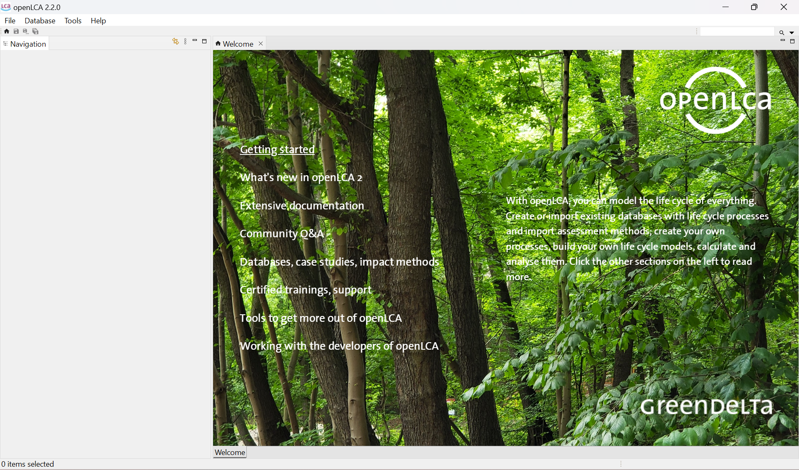
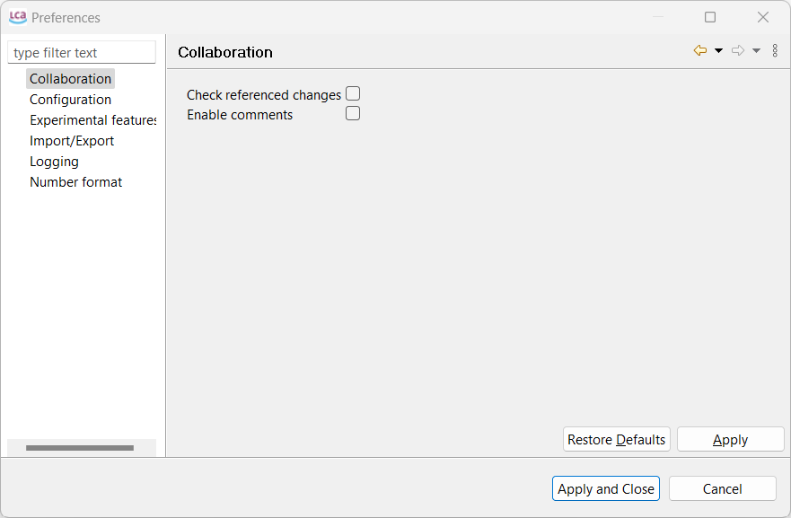
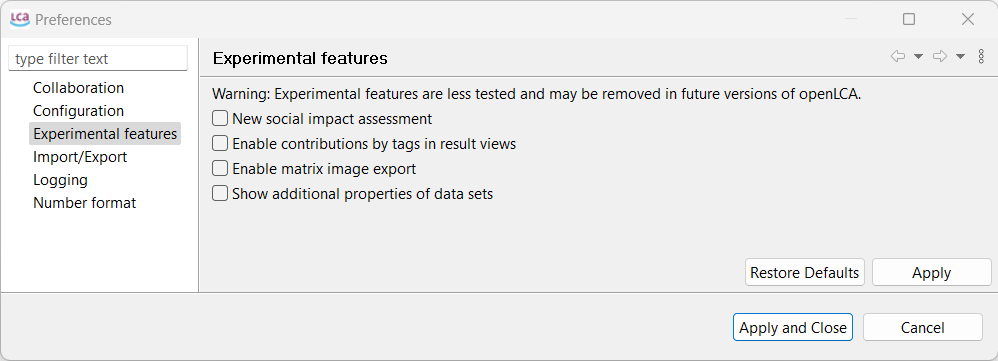
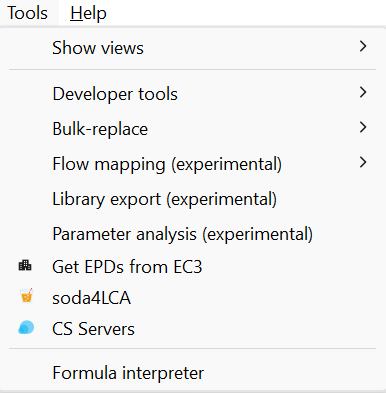
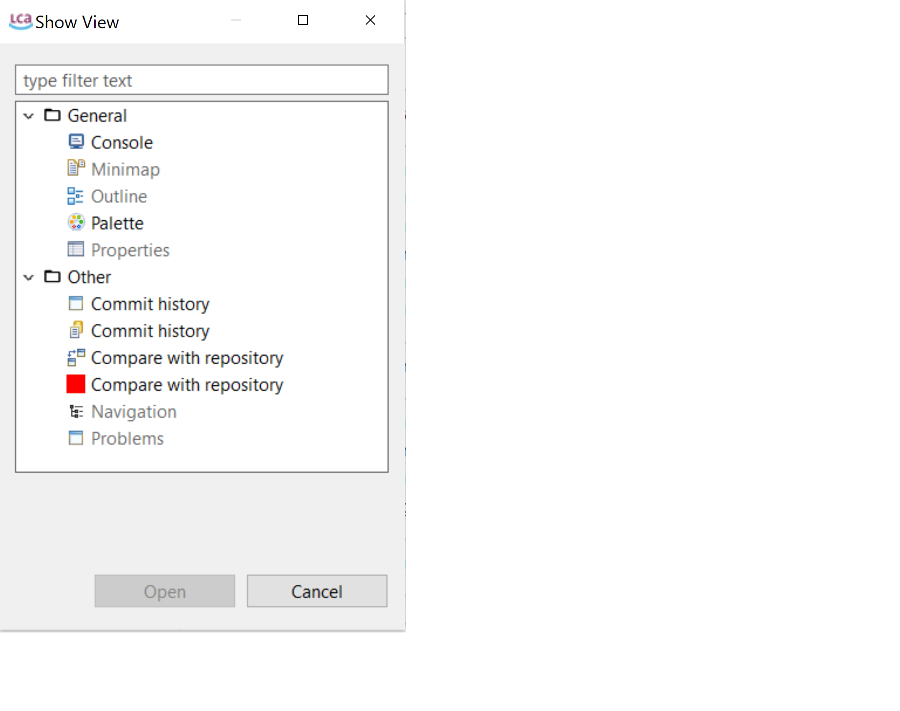
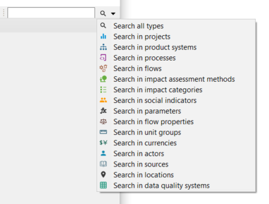
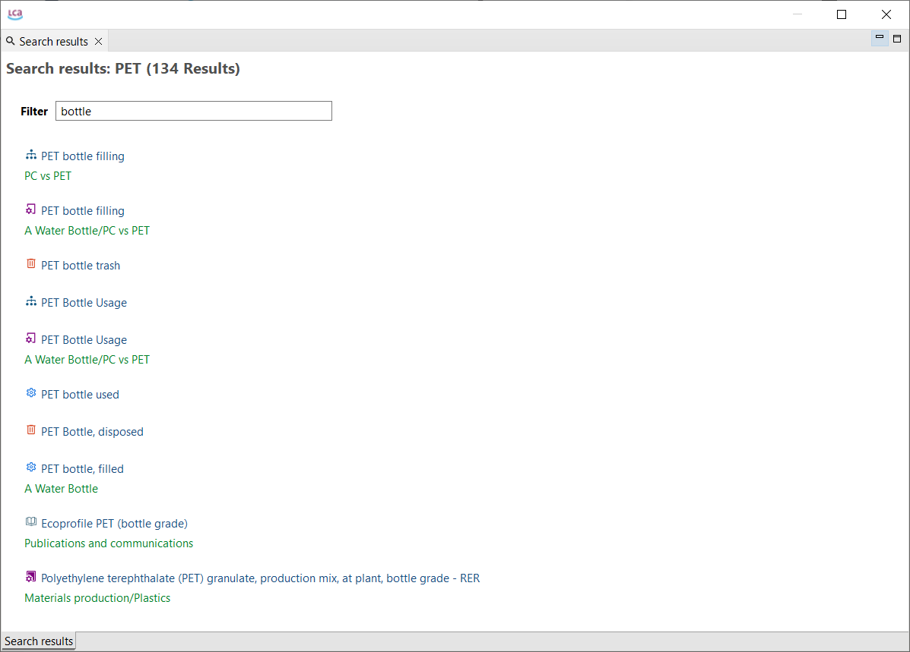

# Running openLCA for the first time

When you launch openLCA for the first time, it does not contain any data. On the left side, you see an empty Navigation field. On the right, you see the Welcome page.

_openLCA Welcome page_

The Welcome page provides quick links to openLCA Nexus, instructional videos, case studies, this user manual, the openLCA download page where you can download the latest version of the software as well as LCIA methods, and, eventually, a link to more information on the openLCA network and its users.

Here, we describe the available toolbar functions, and provide guidance on using openLCA’s basic features:

 _openLCA toolbar_

Click on the &#x25B6; to expand the respective tab:

<b>File</b>

The following options are available under **File**:

-   **Save / Save As... / Save All:** This option saves the work that is currently opened in the editor tabs. Unsaved tabs will be not included in the calculations that will be performed.

-   **Close / Close All:** This option closes the current/all windows opened in the editor.

-   **Preferences:** Under preferences, you can customize openLCA upon your needs. Here, you can find settings as memory allocation for openLCA, and language selection.

    -   **Collaboration:** Here, you can select your preferred configurations for working with the collaboration server. 

		- _Check referenced changes_: if this is checked, openLCA will scan - after selecting datasets for a commit - the database for changes in datasets that are referenced by the selected datasets and suggests to also commit them. E.g. if you want to commit a process dataset, and you have added a newly created flow to the input table, the flow is considered a referenced change.

		- _Enable comments_: if this is checked, openLCA loads comments that were added to data sets on the LCA Collaboration Server and displays them in the model editors.
	
			  
			_Preferences Collaboration_

		More information about the Collaboration Server can be found in the respective [chapter](./collaboserver.md).
	 
	 -  **Configuration:** Here you can choose among eleven available languages (Arabic, Bulgarian, Catalan, Chinese, English, French, German, Italian, Portuguese, Spanish or Turkish). You can also select the maximum memory usage (see [chapter](./installation/memory.md)).
	 
		  
		
		_Preferences Configuration_
		
		- **Graphical editor theme:** You can change now the theme for the model graph and Sankey diagram namely: Dark, Light, Nord Dark, Nord Light, Poimandres. However, to access the dark mode for the whole application, you need to select it on your operating system.
		
		  
		
		- **Reset window layout:** Furthermore, you can reset your window settings if you encounter a bug or if you find yourself lost with the number of open windows.
				
		- **Download calculation libraries:** This option allows you to integrate fast calculation libraries for openLCA. This function is still developed currently.
	
		_**Note**_: You need to restart openLCA to activate configuration changes.         
	
		   
	- **Experimental features:** These features are still in development, but you can already access them by checking this box. We welcome any feedback to further refine them. Here you can activate the novel social impact assessment feature.
		
		  
		_Preferences Experimental Features_

    - **Import/Export:** Here you can change the ILCD Network settings (currently under development).

    - **Logging:** Here you can set what information should be written in openLCA's log file. You can also keep the log file opened permanently if you want.

    - **Number format:** If you are not a fan of the six-decimal display format, you can modify it here. This setting will not affect calculation results and it is just for your convenience, adjusting the format in the user interface. 
	
	In case you made a mistake here, "Restore Defaults" will always bring you back to the default settings.
	
- **Import:** See section "[Importing and combining databases](./databases/importing_and_combining_databases.md)"

- **Export:** See section "[Exporting data](./databases/exporting_databases.md)"
	
- **Exit:** This option closes openLCA, as well as clicking on the small cross at the right corner of openLCA.

<b>Database</b>

_**Note**_: Almost all the functions described here can also be accessed via right click with mouse on the navigation panel.

The following options are available under "**Database**" when a database is opened:

-   **New Database**: For creating a new database, see section "[Creating a new empty database](./databases/create_database.md)" for details.
It is also
    possible to activate the "New Database" function by right-clicking the
    navigation window.

-   **Restore Database:** For restoring a database, see section "[Restoring a database](./databases/restore_database.md)" for details. 

-   **Backup Database:** Copy the database into an archive file to save it.

-   **Validate:** Checks the database about inconsistencies and creates a validation report.

-   **Copy:** Creates a copy of the active database.

-   **Rename:** Renames the active database.

-   **Delete Database:** Deletes the active database from openLCA. Please note, this action is irreversible!

-   **Close Database:** Closes the active database. Alternatively, opening another database will automatically close the active one.

-   **Check linking properties:** Performs a comprehensive provider check on the active database and displays the results in a table. It will show if processes lack a default provider, whether product or waste flows exist with multiple providers, if and which product flows have multiple providers and identifies provider linking options that are uncritical with the active database.

-   **Properties:** Shows the database's location on the computer and the type of the database.

-   **Compress database:** This function will remove deleted datasets from the active database freeing up space in the database. 
	
-	**Contents:** Under the two tabs, "_flows_" and "_processes_" are available. Clicking on them shows a list of all the flows or all the processes within the database. This option allows you to filter all flows using the CAS number or chemical formula.

<b>Tools</b>

The following options are available under "**Tools**":

  
_Options under Tools_

- **Show views**

The following options are available after clicking on "**Show views**" and "**Other**":

  
_Options under **Show views, Other**_

- **_General_**

	- _Console:_ Displays the log file
	- _Minimap:_ Not available, a relict from creating openLCA with eclipse
	- _Outline:_ Displays a list of all the processes of a product system, including all its background processes. It is only applicable after you’ve created a product system. Open the product system’s Model Graph (tab) and choose the "Outline" option from "Views". The outline allows you to choose the processes you wish to show or hide from the Model Graph.
	- _Palette:_ Not available, a relict from creating openLCA with eclipse (don't worry)
	- _Properties:_ Not available, a relict from creating openLCA with eclipse (don't worry)

- **_Other_**

	- _Commit History:_ Shows the commit history of the synchronization with the
    collaboration server, see section "[Link with Collaboration Server](./collaboserver.md)".
	- _Compare with repository:_ Shows the comparison with the
    collaboration server, see section "[Link with Collaboration Server](./collaboserver.md)".
	- _Navigation:_ The Navigation window displays the databases you have imported
    into openLCA and all the data sets they include.

- **Developer Tools:** 

    -   _SQL_: A tool that can be used to carry out SQL queries in openLCA.
    -   _Console_: The console tool is the live feed of our program with the same content as our log-file.
    -   _Python_: openLCA supports the possibility to run Python programs directly in openLCA. With this feature, you can automate calculations in openLCA, write your own data imports or exports, perform sensitivity analysis calculations by varying parameter values, and much more.
    -   _IPC Server_: Inter-Process Communication is a platform-independent data exchange interface via _HTTP_. _IPC_ Server allows running openLCA services via Python’s standard library

	However, to run the scripts use the respective button (green arrow) in the tool bar.

- **Bulk-replace:** It is a tool that allows the replacement of a flow or product
    provider with another flow or provider. To find out more details on bulk-replace see "[Using mapping files in openLCA](../databases/mapping_validation.md)" chapter.
	
- **Flow mapping (experimental):** Still under development but already available for you!

- **Library export (experimental):** Still under development but already available for you!

- **Parameter analysis (experimental):** Still under development but already available for you!

- **soda4LCA:** See [soda4LCA](<https://manuals.openlca.org/openLCA2-manual/epds/soda4lca.html>) chapter.

- **CS Servers:** See [the collaboration server manual](<https://manuals.openlca.org/lca-collaboration-server/>).

- **Get EPDs from EC3:** With openLCA 2 it is now possible to download or download EPDs from EC3 (Embodied Carbon in Construction Calculator) by [Building Transparency](<https://www.buildingtransparency.org/>). This requires access to the Building Transparancy server. Also an upload is possible.

- **Formula interpreter:** Use this interpreter to check if your formulas are correct. More information on the interpreter is accessible by opening the formula interpreter and typing "help" in the command line.

	  
	_openLCA Formula Interpreter_

<b>Help</b>

Under "Help" you can find information on the openLCA copyright and openLCA log file as well as a link to this user manual and other free resources. 

<b>openLCA search function</b>

On the top-right corner of the page, the "Search" function allows you to search for keywords in openLCA (e.g. name of flows, processes, social indicators, currencies, etc.). You can search across all sections or specify specific areas. In openLCA 2, you can also search for datasets within accessible repositories on the collaboration server and import them into the local working database.

  
_Search function in openLCA_  

When you search for a term, you can even filter the results:

  
_Filtering after using the search function in openLCA_  

<b>Using the editor function</b>

As displayed, there is a small icon with two yellow arrows on the on the top-right corner of the navigation. This is the "Link with the editor" function and can be active (light blue highlight) or deactived (no highlight). If the option is activated, the flows/processes/product systems being opened in the main window of openLCA (editor) will be opened in the navigation panel. If it is deactivated, the currently opened flow/process/product system will not be opened in the navigation. 

  
_Activated "Link with Editor" option_

This option is helpfful if you are looking for a flows/processes/product systems in a database with the option activated it will automatically open the respective folder structure in the navigation panel. Once found, you can deactivate the option again.

Moreover, if you click on the three dots next to the editor you will also find the "Refresh" function. It refreshes the "Navigator". For example, when creating data sets in a Python script or via the IPC server, they won't show up in the "Navigator" if you do not refresh it.

<b>Working with tabs</b>

In openLCA 2, every new window is organized as a tab next to the welcome one within the main window. Right-clicking on a tab provides different management options, improving the user-friendliness of openLCA.

  
_Right-clicking a tab_

Tabs can be detached and moved around on the screen. By dragging and dropping a detached tab next to an existing tab in openLCA, you can reverse the detachment. This feature allows you to run openLCA in a single-window and multi-window mode, particularly beneficial when working with multiple screens.

To show two tabs either underneath or next to each other, drag one tab till a double line appears on your screen.  

_Placing tabs underneath or next to each other_  

**_Note:_** An asterisk "*" in front of the tab's name indicates that the data of your tab is
not saved and therefore an older state of this tab will be included in any calculation. 

_**Note**_: If you are unhappy with your choice of tabs and windows, you can always reset them under File → Preferences → Configuration → Reset Window. 

